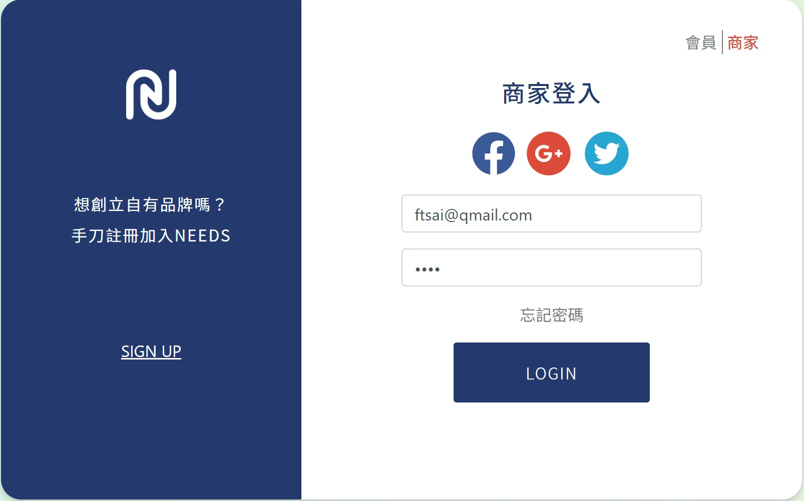
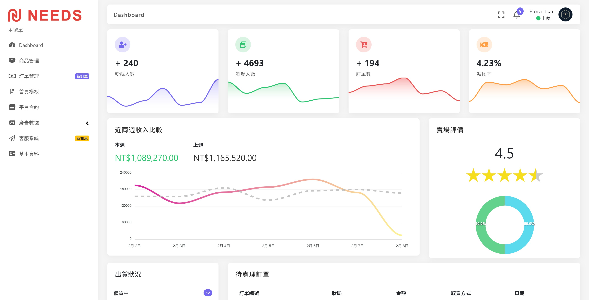

# Usage

生活文創平台-前端開發專案

Port:3000

WebServer Node.js 專案連結 https://github.com/bookmountain/needs-backend-nodejs
 
 
至 http://localhost/phpmyadmin/ 新增一個名為"needs"的table
 
將 node 專案資料夾底下的 sql 檔案匯入至 "needs" 這個table這個table
 
使用兩個不同 windows 各自開啟 react 和 node 專案
 
npm start 開啟 server
 
 
因後臺需使用者登入才能進入，故在首頁按右上角登入
 
點選google icon自動帶入帳號密碼登入

 
 
於首頁的使用者icon -> 品牌管理中心，進入 http://localhost:3000/customer-backend

